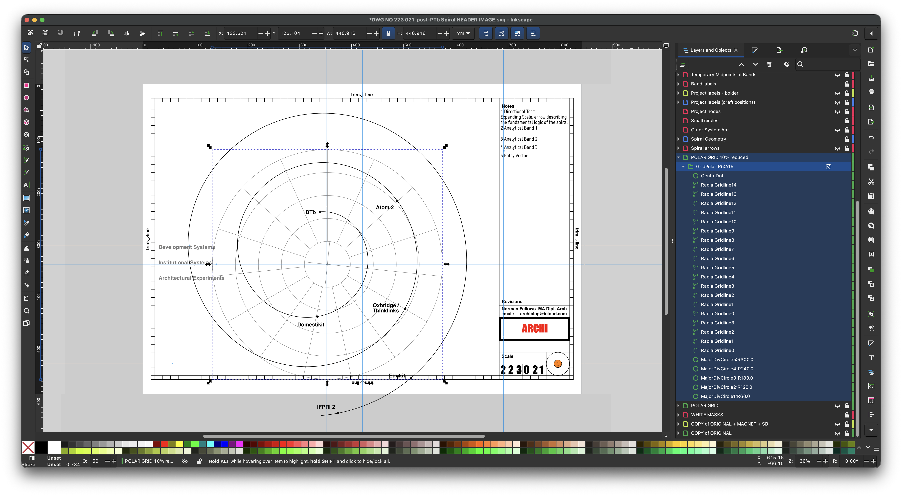

# # ARCHITECTURE: Redefining it as progressing

[Home](https://archiblog.github.io) | [Repos](https://github.com/Archiblog/?tab=repositories) | [Fun Palace](https://archiblog.github.io/fun-palace) | [PTb](https://archiblog.github.io/ptb) | [BMI](https://archiblog.github.io/bmi/) | [Edukit](https://archiblog.github.io/edukit/) | [Biography](https://github.com/Archiblog) 

* **Figure 1.** First public release of the post-PTb Spiral framework. Source: [Norman Fellows repositories](https://github.com/Archiblog?tab=repositories)

This work defines architecture which may be said to be *progressing* through a catalogue of interconnected studies.

Rather than presenting a linear thesis, the material is structured as a set of entries that can be approached independently while contributing to a wider framework.

---

## post-PTb spiral

- [Edukit](https://archiblog.github.io/edukit/)  A world educational system being tested in the UK in ATOM 2 and OCC
- [Domestikit](https://archiblog.github.io/domestikit/)  A worldwide dwelling service being tested in the Uk at Rochdale and at Tilbury

---

## PTb spiral

- [BMI Study](https://archiblog.github.io/bmi/)  A shadow institution...

---

## pre-PTb spiral

- [Chronology](./chronology.md)  A developing timeline of projects, influences, and phases of work
- [Catalogue](./catalogue.md) An index of entries across the system
  
---

## Approach

The work proceeds through:

* questioning rather than problem-solving
* systems rather than objects
* progression rather than completion
* the commons rather than isolated authorship

---

## Orientation

This site is not intended to be read sequentially.

It is designed to be navigated.
